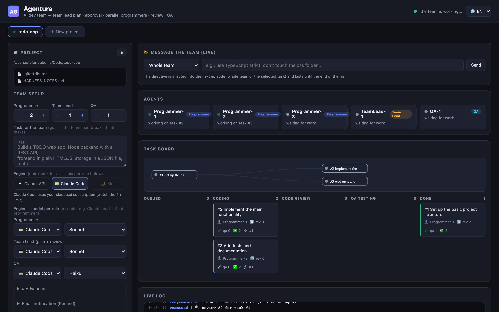
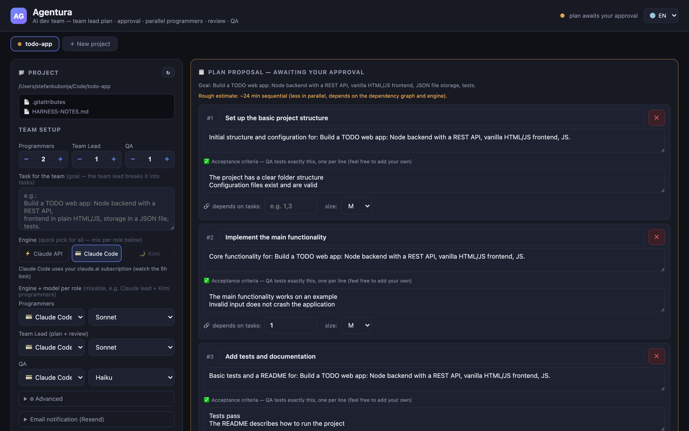
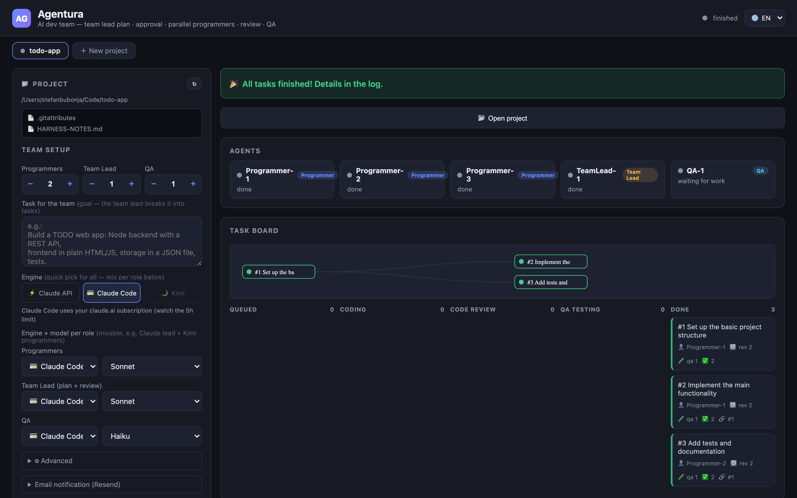

# Agentura — your AI dev team

Agentura orchestrates a **team of AI agents** that build software together, the way a real team does: the team lead plans and reviews, programmers build in parallel, QA verifies every acceptance criterion — and you approve the plan and watch it all live.

<p align="center">
  
</p>

<table>
  <tr>
    <td align="center" width="50%">
      <br>
      <sub>The team lead's plan — editable tasks + acceptance criteria, awaiting your approval</sub>
    </td>
    <td align="center" width="50%">
      <br>
      <sub>Run finished — every task reviewed, QA-passed and merged</sub>
    </td>
  </tr>
</table>

## How it works

```
GOAL ──► TEAM LEAD (plan) ──► 📋 PLAN → your APPROVAL (edit / object / OK)
                                              │ approved
                                              ▼
tasks ──round-robin──► PROGRAMMERS ──► REVIEW QUEUE ──► TEAM LEAD (code review)
                            ▲                              │
                            │   CHANGES_REQUESTED          │ APPROVED
                            ◄──────────────────────────────┤
                            │                              ▼
                            │   FAILED (QA report)      QA QUEUE ──► QA AGENT
                            ◄──────────────────────────────┘
                                                           │ PASSED
                                                           ▼
                                             git merge + task DONE
                                   (all done) ──► integration QA ──► 📧 email
```

- **Team lead (planner)** — you give it a **goal**; it explores the workspace and produces a **task plan with acceptance criteria** that comes back to you **for approval**. Edit tasks, send objections for a re-plan, or approve.
- **Programmers** — parallel agents, each working in an **isolated git worktree** (branch `harness/task-N`). Approved tasks are distributed round-robin and run **simultaneously**, with `dependsOn` ordering where the plan requires it.
- **Team lead (code reviewer)** — reviews every change against the task and its acceptance criteria: `APPROVED` or `CHANGES_REQUESTED` with a concrete list; the loop runs until approval.
- **QA** — verifies each acceptance criterion with real commands (tests, browser smoke test for web projects, iOS-simulator + Maestro smoke for Expo apps). `PASSED` → merge into the main branch; `FAILED` → back to the programmer with a report.
- **Integration QA** — after all merges, one agent verifies the project **as a whole** against the full acceptance checklist (mandatory simulator run for mobile projects), with fix rounds if it fails.

**Zero runtime dependencies** — pure Node.js (≥18). No `npm install` needed to run the server.

## Quick start

```bash
npm start
# → http://localhost:4400
```

Put your keys in a `.env` file in the project root (loaded automatically):

```
ANTHROPIC_API_KEY=sk-ant-...       # Claude API engine (omit → MOCK simulation)
CLAUDE_CODE_OAUTH_TOKEN=...        # Claude Code subscription engine (from `claude setup-token`)
KIMI_API_KEY=sk-kimi-...           # optional: Kimi For Coding engine
RESEND_API_KEY=re_...              # optional: email notifications via resend.com
```

Without any key, Agentura runs a **mock simulation** of the whole pipeline — ideal for a first look.

## Engines — mix and match per role

Each role (programmers / team lead / QA) can run on a different engine, picked in the UI:

- **⚡ Claude API** — direct Messages API calls, pay per token.
- **💳 Claude Code (subscription)** — episodes run through headless `claude -p`, billed to your claude.ai Pro/Max subscription instead of API credits. Run `claude setup-token` once and put the token in `.env` as `CLAUDE_CODE_OAUTH_TOKEN`. Note: parallel programmers consume the 5-hour plan window quickly.
- **🌙 Kimi For Coding** — Kimi's Anthropic-compatible endpoint, billed to a Kimi subscription. A popular mix: Claude team lead + Kimi programmers.

Model lists are fetched live from each provider and picked per role in the UI.

## Highlights

- **Sessions bound to directories** — each project tab is permanently tied to a folder (picked once via the built-in file browser); a file tree with previews sits in the left panel.
- **Live agent streams** — watch every agent's tool calls, commands and output in real time, per lane.
- **Ask mode** — ask the team lead a question about the project and get an answer instead of a task plan; solo mode also runs a single programmer / reviewer / QA directly.
- **Crash-safe runs** — active runs snapshot continuously to `data/active/`; after a server restart they resume, including Claude Code CLI session resume (`--resume`) mid-task.
- **Rate-limit handling** — subscription limit hit → 15-minute pause + email + a "resume now" button; per-task retry with a fresh programmer for stuck tasks.
- **Merge safety** — per-task worktrees, pre-merge snapshot of a dirty main workspace, merge-conflict recovery that re-bases the task with the previous diff as reference.
- **Merge gate & PR mode** — optionally hold each task for your approval (with a diff viewer) before merge, or push branches and open GitHub PRs (`gh` CLI) instead of merging locally.
- **Live steering** — send directives to the whole team or a single task mid-run.
- **Cost tracking** — tokens and estimated cost per task, per agent and total (including prompt-caching savings); run history in `data/runs/`.
- **Project memory** — agents read and append lessons to `HARNESS-NOTES.md` in the workspace.
- **Project skills** — drop `SKILL.md` files into `.claude/skills/`; their content is injected into programmer/reviewer/QA episodes on every engine.
- **Email notifications** — run finished / limit hit / tasks stuck, via [Resend](https://resend.com).
- **Languages** — UI and agent-facing messages in **English** by default, **Serbian** available from the language picker.

## Project skills

Per-project instructions for the agents. A skill is a folder with a `SKILL.md` — the same format as Claude Code Agent Skills (YAML frontmatter, then a markdown body) — read from the session's bound directory:

```
<project>/.claude/skills/
  tdd/
    SKILL.md
  api-conventions/
    SKILL.md
```

A minimal `SKILL.md`:

```markdown
---
name: tdd
description: Red-green-refactor loop expected for every code change
roles: programmer, qa        # optional
---

Write the failing test first, then the minimal implementation, then refactor.
```

`name` and `description` are required; `roles` is optional — without it a skill applies to programmers, the reviewer and QA. The planner only receives skills that explicitly set `roles: planner`.

Matching skills are **injected in full into the system prompt** of each agent episode, and this works on **every engine** — Claude API, Claude Code subscription and Kimi. Native Claude Code skills are only passively listed to the model and rarely get used; injection guarantees the guidance is actually in the agent's context. The orchestrator logs `🧩 Applying project skills (…)` per episode.

Caps: 5000 characters per skill, 15000 per episode; skills over the budget are named in the prompt but their content is not included.

Community skill collections in this format work as drop-ins — installing one is a folder copy (respect the collection's license), e.g. from [mattpocock/skills](https://github.com/mattpocock/skills):

```bash
git clone https://github.com/mattpocock/skills /tmp/skills
cp -r /tmp/skills/skills/engineering/tdd <project>/.claude/skills/tdd
```

## Desktop app (Electron)

```bash
npm install            # dev deps only (electron, electron-builder)
npm run start:electron # desktop app with a first-run key wizard
npm run dist:mac       # build a macOS .dmg (arm64)
```

The Electron shell stores keys in the OS user-data dir (never in the repo) and runs the same zero-dependency server underneath. `npm start` keeps working exactly as before.

## Structure

```
server/
  index.js         HTTP server + REST API + SSE stream
  orchestrator.js  planning, worktree isolation, dependencies, review/QA loops, merge, retry, costs
  agent.js         agent loop on the Messages API (tool use, prompt caching)
  claude-code.js   headless Claude Code CLI engine (subscription billing, session resume)
  tools.js         agent tools (fs + shell + grep/glob/edit, sandboxed to the workspace)
  roles.js         system prompts: planner / programmer / reviewer / QA / integration QA
  browser-smoke.mjs / mobile-smoke.mjs   real-app smoke harnesses (web, Expo + iOS simulator + Maestro)
  mock.js          full pipeline simulation without any key
  mailer.js        Resend email
  i18n.js          server-side EN/SR message catalog
public/
  index.html       the whole UI (no framework)
electron/
  main.js / setup.html   desktop shell + first-run key wizard
```

## Security notes

- Agents execute shell commands **on the machine running the server** (that's what makes them useful). The server therefore binds to `127.0.0.1` by default — set `HOST=0.0.0.0` only on a network you trust (e.g. Tailscale).
- API keys never leave `.env` / the Electron user-data dir; they are stripped from run snapshots and logs.

## License

[FSL-1.1-Apache-2.0](LICENSE.md) — source-available: free for internal use, education, research and professional services; commercial redistribution/competing use is not permitted. Each release automatically converts to Apache 2.0 two years after publication. See [CONTRIBUTING.md](CONTRIBUTING.md) for the issues/PR policy.
